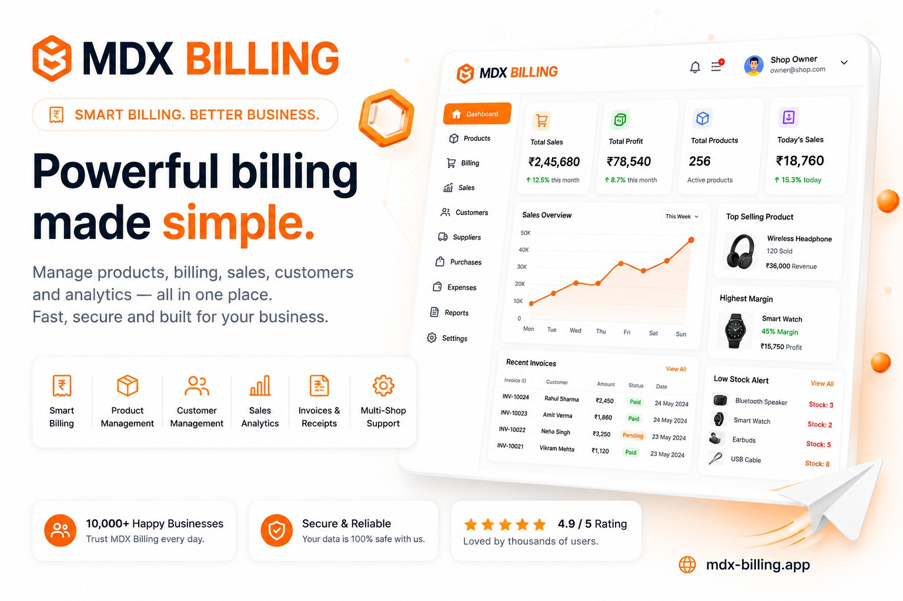
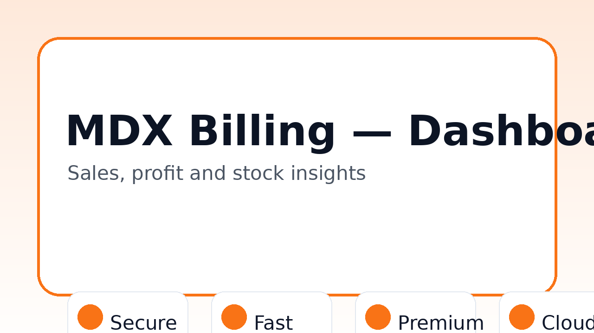
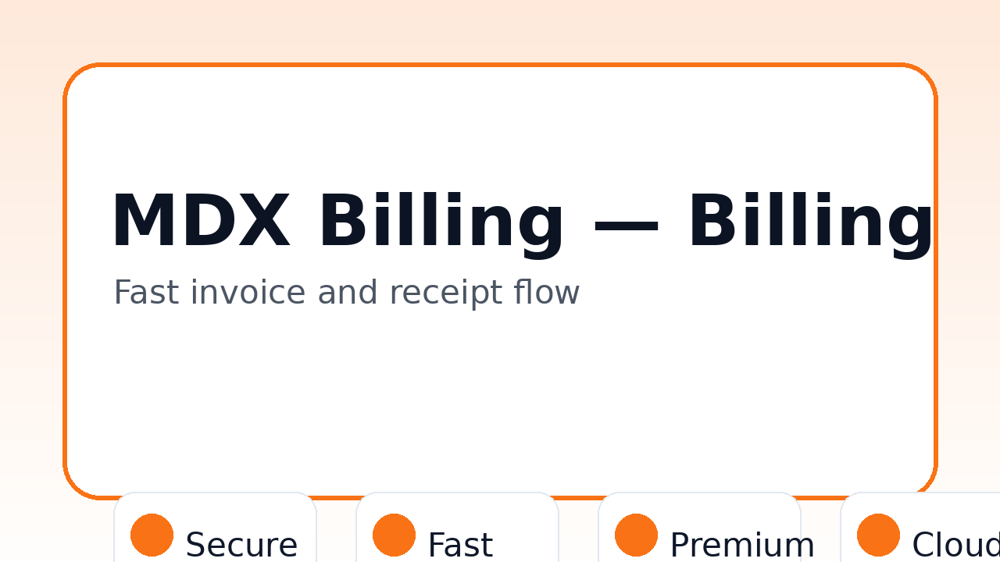
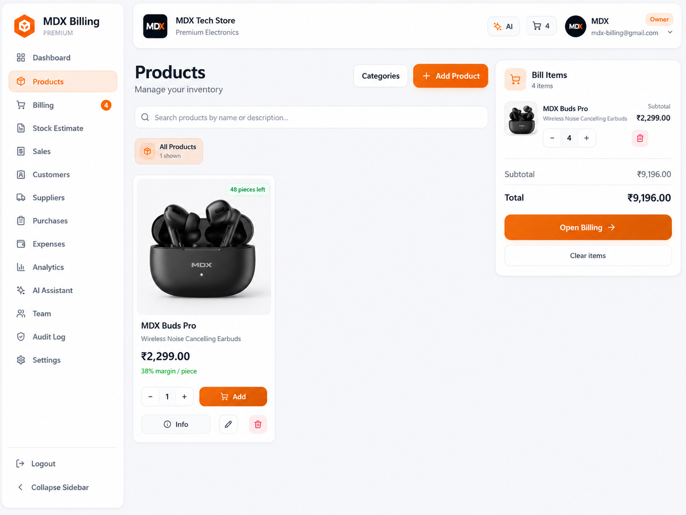
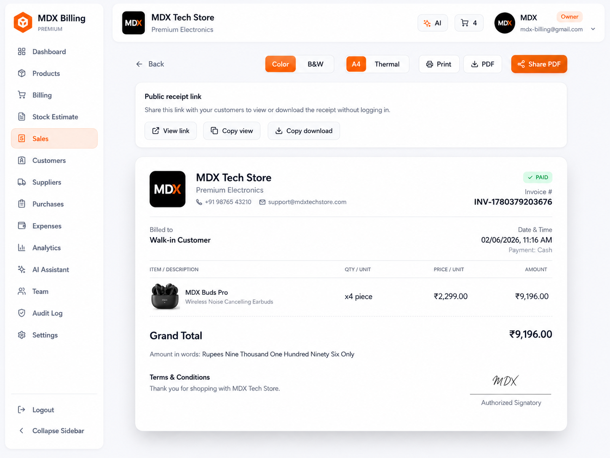

<div align="center">

# 🧾 MDX Billing App



**Powerful billing made simple for shops, stores, and small businesses.**

[](#)
[](#download-apk)
[](LICENSE)
[](#credits)

</div>

---

## ✨ Overview

**MDX Billing App** is a modern billing, invoice, product, sales, customer, supplier, and shop management application designed for small businesses and product-based stores.

It is built to help shop owners manage billing, products, inventory, sales, customers, receipts, and analytics from one clean mobile-friendly app.

> Developed by **『⛥ 𝗠𝗗 𝗧𝗘𝗖𝗛 𝗛𝗔𝗖𝗞𝗘𝗥 ⛥』**

---

## 🚀 Key Features

| Area | Features |
|---|---|
| 🧾 Billing | Normal invoice, GST invoice, estimate bill, receipt generation, receipt sharing |
| 📦 Products | Product images, categories, suppliers, stock, cost price, selling price, unit tracking |
| 📊 Dashboard | Total sales, profit, products, low-stock alerts, revenue trend, overview cards |
| 👥 Customers | Customer name, phone, email, GST details, sales history |
| 🚚 Suppliers | Supplier records, product links, purchase details |
| 🛒 Sales | Sales history, invoices, payment status, bill type filters |
| 🏪 Multi-shop | Shop profile, shop logo, shop settings, role-based access |
| 🔐 Security | Protected routes, secure sessions, user data isolation, role system |
| 🎨 UI | Light mode, dark mode, glass mode, responsive mobile-first design |
| 📤 Import/Export | Product/customer CSV import/export and backup-ready structure |

---

## 📱 Download APK

The latest APK will be published in **GitHub Releases**.

➡️ Go to **Releases** → download the newest `.apk` file.

Local release folder:

```txt
releases/apk/
```

---

## 🖼️ Screenshots

| Dashboard | Billing |
|---|---|
|  |  |

| Products | Receipt |
|---|---|
|  |  |


---

## 🧩 App Modules

```txt
Dashboard
Products
Billing
Sales
Customers
Suppliers
Categories
Settings
Admin Panel
```

---

## 🔐 Security Model

MDX Billing App is designed with security-first shop data handling:

- Secure login flow
- Protected dashboard routes
- User-specific shop data isolation
- Role-based permissions: Owner, Manager, Cashier
- Admin-only protected routes
- Safe file upload handling
- Input validation
- No secrets committed to GitHub

---

## 🛠️ Tech Stack

This repository is release/documentation ready. Update this section based on your final implementation.

- React / Next.js / Expo depending on final app target
- TypeScript
- Supabase / Firebase / secure backend
- Modern responsive UI
- Cloud sync-ready data structure
- Mobile APK release workflow

---

## 📂 Repository Structure

```txt
mdx-billing/
  README.md
  LICENSE
  CHANGELOG.md
  releases/apk/
  screenshots/
  assets/
  docs/
```

---

## 🛣️ Roadmap

- [ ] APK release upload
- [ ] Play Store-ready screenshots
- [ ] GST invoice export
- [ ] Receipt email sending
- [ ] Product barcode support
- [ ] Admin analytics
- [ ] Import/export backup system
- [ ] Multi-shop dashboard

---

## 📚 Documentation

- [Installation](docs/installation.md)
- [Privacy Policy](docs/privacy.md)
- [Terms](docs/terms.md)

---

## 📝 Changelog

See [CHANGELOG.md](CHANGELOG.md).

---

## 👑 Credits

Developed by **『⛥ 𝗠𝗗 𝗧𝗘𝗖𝗛 𝗛𝗔𝗖𝗞𝗘𝗥 ⛥』**

---

## 📄 License

This project is licensed under the [MIT License](LICENSE).
